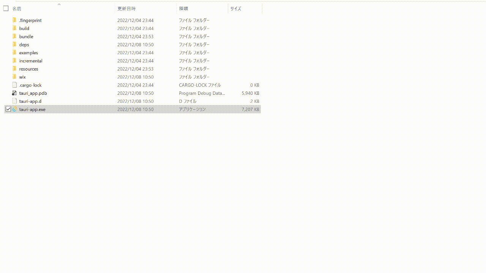

# Tauri Kanban

Tauriの勉強のために開発したKanban Boardです。
Tauri × React × TypeScriptでできています。
Windowsで動作します。



[Qiita](https://qiita.com/k-kanno/private/26d721bea0cec361f71a)も良かったら見てください。

# Usage
.envファイルをsrc-tauri直下に配置してください。
`TICKETS_FILE_PATH`にチケットの情報を記録するためのファイルパス(JSON)を記載してください。
```
TICKETS_FILE_PATH=xxxx.json
```